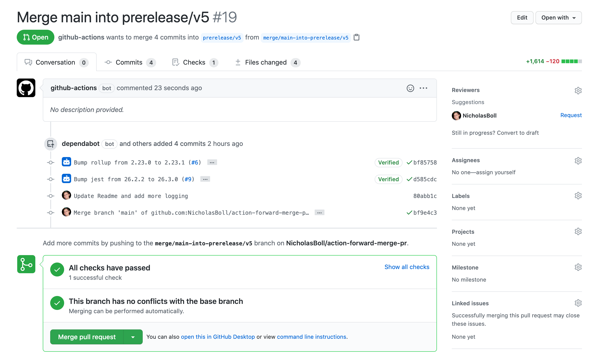

# Create a forward-merge pull request to keep support branches in sync

Use this action to help keep support branches in sync with upstream branches. Your branch strategy looks something like this:

```
 ---+----- support/v3
     \
 --+--+--- main
    \  \
 -+--+--+- prerelease/v5
```

Where each `+` is a pull request commit and each `\` is a forward-merge into another branch. This strategy makes sure that a commit in `support/v3` will be forward-merged into `main` and all commits in `main` will be forward merged into `prerelease/v5`.

In the first `support/v3` commit, a branch named `merge/support/v3-into-main` will be created and a pull request into `main` will be created. The pull request will request a review from everyone listed as an author in the commit range (assuming the provided token has access to add reviewers).

It is best to use this action on `push`. It will not create another pull request if a `merge` pull request is already open. You will have to merge or close the pull request created by this action and delete the branch for another to be created. It is possible for additional changes to happen to branches before the merge pull request is merged. The script will not create another merge pull request branch. To combat this, you can either do a cron workflow or set up a manual workflow trigger.

This action uses the Github API rather than `git` commands. This means the provided `token` will decrease the hourly limit of API calls. The exact amount of calls varies depending on the event type. For a `push`, it will use a total of 6 if there is no existing merge pull request currently opened.

This action will not resolve any merge conflicts. The GitHub UI will prompt you for how to resolve merge conflicts. Some may be resolved using the GitHub interface while others will require the command line.

This action uses `git`'s comparison tool which uses commit ranges base on commit hashes. Use the `merge` strategy when merging this pull request. Using `squash` or `rebase` will rewrite commit hashes and will still show commits when the branches are later compared an will cause this action to create a new pull request with the same commits in the range after merging.

This will create a pull request that looks like:



## Inputs

> `token`

This should most likely be `${{secrets.GITHUB_TOKEN}}`, but can be any token that has write access to your repository. This will be a token of the user account you would like to be the owner of the pull requests that are created. This should be a bot account.

> `branches`

A string of forward-merge branch combinations separated by a comma. Each branch pair is separated by a `+`. If you would like to keep a support branch named `main` in sync with `support/v3` where all commits to `support/v3` should also be in `main`, then you would have `support/v3+main`. If you would also like all commits to `main` to also be in `prerelease/v5`, then you'd add another like this: `support/v3+main,main+prerelease/v5`. The `on.push.branches` should include the left-side of the `+` to make sure the workflow file triggers on changes to those branches.

## Example

```yaml
name: 'forward-merge'
on:
  push:
    branches: # List all "from" branches - all branches that should be forward merged
      - support/*
      - main
  # Allow manual triggering: This requires you to choose a `ref`. This should be the branch with changes
  workflow_dispatch:
  # run 0:00 UTC every day
  schedule:
    - cron: '0 0 * * *'

jobs:
  forward-merge:
    runs-on: ubuntu-latest
    steps:
      - uses: NicholasBoll/action-forward-merge-pr@v1.0.0
        with:
          token: ${{secrets.GITHUB_TOKEN}}
          branches: support/v3+main,main+prerelease/v5
```
